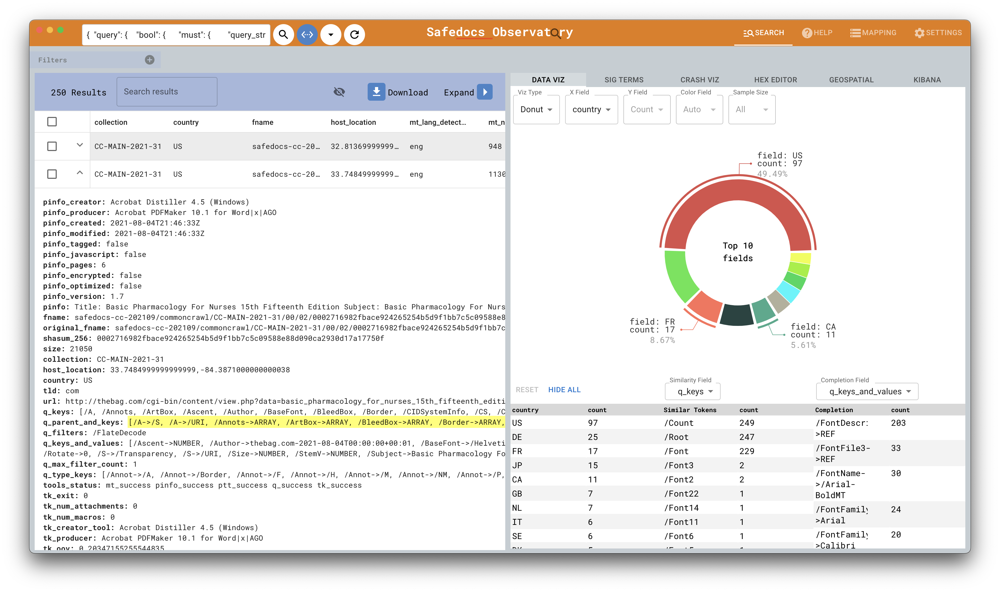

# DARPA Safedocs File Observatory
[](https://zenodo.org/badge/latestdoi/613576432)



The Safedocs File Observatory application is a tool meant to allow for the fast filtering and visualization of large document datasets based on low-level metadata that has been parsed and stored. Through this tool, a user has access to a variety of dynamic visualization tools to gain insight into specific fields by basic value counts as well as the ability to trigger more complex, multi-level, Elasticsearch queries.

# Features

## Search View

The search view is where the bulk of operations happen. It is divided into two sections; a section for viewing individual document results returned from searches and a section dedicated to visualizing this data.

### Searching For Documents
Searches are performed from the top search bar and can either be done in `basic` or `advanced` mode. In basic mode, terms you enter in the searchbar will be looked for across all fields in a document and the best matches will be returned. In advanced mode (triggered by clicking the angle brackets icon next to the search button), you have the ability to directly customize the query sent to elasticsearch. The refresh icon next to the `advanced` mode button allows you to refresh a query if something isn't working as expected.

#### Basic Search Query
The default search query performed in basic mode:
```json
{
  "query": {
    "bool": {
      "must": {
        "query_string": {
          "query": "<your text here>",
          "type": "best_fields"
        }
      }
    }
  }
}
```

#### Advanced Search Query
In advanced mode, you can put any valid Elasticsearch query to search for documents, however, there are a few caveats to be aware of if you want data to show up from an advanced query in the `Completion` and `Similarity` tables below the `Data Viz` tab. These tables rely on a `suggest` query being performed initially with the specific names `similarity-suggestion` an `completion` for each table respectively. Once data from these queries are received, a backend process will automatically be triggered that will re-query each `completion` result to get accurate counts. The easiest way to see these underlying queries and modify them is to perform an initial search and then switch to the advanced mode, which will provide you with a query similar to the following that you can then edit.

```json
{
  "query": {
    "bool": {
      "must": {
        "query_string": {
          "query": "test",
          "type": "best_fields"
        }
      }
    }
  },
  "suggest": {
    "similarity-suggestion": {
      "text": "test",
      "term": {
        "field": "q_parent_and_keys",
        "suggest_mode": "always",
        "sort": "frequency",
        "size": 100,
        "max_edits": 2,
        "min_word_length": 2,
        "max_term_freq": 2000000
      }
    },
    "completion": {
      "prefix": "test",
      "completion": {
        "field": "q_keys_and_values.completion",
        "size": 2000,
        "skip_duplicates": true
      }
    }
  },
  "size": 250,
  "from": 0,
  "sort": []
}
```

### Filtering Searches
The other key way to search for documents is by using filters. Filters are available in a collapsed menu below the search bar and are meant to be stacked on top of basic search queries (filtering through the UI is not available in advanced search mode). The number to the right of a filter/field name represents the unique count of terms for a specific field returned along with your basic search query. This count is limited to the top 1000 unique terms by default, but if you expand a filter, you have the option to begin typing to further narrow down which terms you are looking for, which will perform subsequent queries to pull in more results.

### Viewing Search Results

Results returned from a search query will automatically be populated in the table below the search box. The number in the top left of the table will show the total count of results returned from a query, but since queries can be quite large, the table is virtualized and will by default only be populated with up to 250 documents initially. As you scroll through the table, subsequent queries will be performed to increase this number. All **visible** fields will be shown as columns in the table, but if you want to see **all** fields associated with a specific document, you can click the arrow next to the checkbox on the left side of a row.

#### Modifying Columns

##### Visibility
Visible columns in the search table can be toggled in three ways. The first is by clicking the "eye" icon in the table header and manually selecting/unselecting which columns you want to see, which will be included or excluded immediately. This can be quite tedious if your goal is to unselect all columns or rapidly select a few very specific ones. For this purpose, you can also perform this selection process from either the `Mapping` tab, which allows you to go through every Elasticsearch mapping field and control whether it is visible, or from the bottom of the `Settings` tab, which mirrors the data in the other two locations, but allows for editing in a list format. 

##### Column Order
In addition to editing visibility of columns, you can also rearrange the order of columns. Similar to changing the visibility of columns, this can be done in three places. From the search table, you can drag and drop an individual column as needed for immediate updates. From the `Mappings` tab you can perform this dragging rearrangement while editing all Mapping field properties. Lastly, from the bottom of the `Settings` tab, you can drag and drop tags in a list arrangement.

##### Sort Order
The last type of modification you can do to columns in the search table is defining the sort order in which results are returned. This is done by hovering over a column name in the search table and clicking on the up or down arrow that appears next to it. Since the table is virtualized and not all results are immediately shown, changing the sort order requires another Elasticsearch query to be performed, so this might take a second.

#### Downloading
On the top right of the search table, you will see an option for downloading either your current selection of documents or a variety of different sample sizes of documents from your query. In order for this feature to work however, there must be a clear mapping specified between search results and actual document files. This can be configured in the `Settings` tab under `Download Settings`. From this section, you can configure which field corresponds to the path of a document and you can either have a request be made to a remote API or you can select a local or mounted root folder containing the respective documents.

### Data Visualization
The data visualization section is the right half of the `Search` tab. This section contains a sub-tab for dynamic count visualizations (`Data Viz`), a visualization of significant terms for a respective field (`Sig Terms`), a Trail of Bit's Polyfile Hex Editor integration (`Hex Editor`), a crash analytics visualization (`Crash Viz`), a geospatial coordinate plotting visualization (`Geospatial`), and lastly a direct `Kibana` integration.

#### Data Viz
The Data Viz tab contains a dynamic visualization that breaks down the counts of the top terms for a selected field in your given query. In the top left of this tab, you can select which field you want to visualize and which type of visualization you want to use. Currently there is support for a `Donut`, `Bar Chart`, and `Treemap` visualization. In the `Donut` visualization, clicking on a specific section will toggle the visibilty of the field label (which is useful for this visualization specifically so that labels don't overlap). Below the `Data Viz` visualization section, there are 3 tables; a `Count` table, a `Similar Tokens` table, and a `Completion` table.

##### Count Table
The Count Table, unlike the above visualizations, includes all of the returned terms along with their counts rather than just the top ones. Additionally, clicking on the name of a term will toggle it's visibility in the above visualizations.

##### Similar Tokens Table
The Similarity table contains the results of the similarity suggestion query that is automatically performed alongside a `basic` search and will be performed along with an `advanced` search if a suggest query named `similarity-suggestion` is included (see [Advanced Search Query](####advanced-search-query)). The dropdown above this table allows for the configuration of which field to use for this query.

##### Completion Table
The Completion table, like the similar tokens table, contains the results of the completion suggestion query that is automatically performed alongside a `basic` search and along with an `advanced` search if a suggest query named `completion` is included (again see [Advanced Search Query](####advanced-search-query)). Each result in this table has been re-queried to provide accurate counts. Like the Similarity table, you can also configure which field to use for the query using the dropdown above the table. However, since this query specifically requires a `completion` analyzer to specified in the Elasticsearch mapping, field options are limited to those that have this analyzer defined.

#### Sig Terms
The Significant Terms tab contains a specialized visualization specifically for a Significant Terms query. This query first requires a field to be selected from the dropdown below the tab name and then will execute the following sub-sequent Elasticsearch query to determine which terms for that field are the most significant using chi-square:
```json
{
  "query": {
    "query_string": {
      "query": "q_keys:/.FontDescriptor/" // Example Query
    }
  },
  "size": 0,
  "aggregations": {
    "my_sample": {
      "sampler": {
        "shard_size": 10000
      },
      "aggregations": {
        "keywords": {
          "significant_terms": {
            "field": "tk_creator_tool.keyword", //  Field selected: tk_creator_tool
            "chi_square": {
              "background_is_superset": false
            }
          }
        }
      }
    }
  }
}
```
Results for this query are returned in a Treemap visualization. It is also important to have this tab first open before searching to ensure your visualization will be shown.

#### Hex Editor

The Hex Editor tab contains a graphical interface for the Trail of Bit's Polyfile tool. This can be used by either selecting a document from your computer or if you have the download settings configured (see [Downloading](#downloading)), you can select documents in the search table and choose them from the `Select Document` dropdown. Once a documnet is selected, make sure an output directory is also specified and then click `Generate`. In the backend, this will spin up a Docker container that will run Polyfile on your document and generate an HTML hex editor for it as an output. This may take a few minutes to complete, but once it does, the `Generate` button will be replaced with an `Open` button to pop the Hex Editor out in a new window. You can open previously generated Hex Editor HTML files (that are in the output folder you specified) through the bottom dropdown.

#### Crash Viz
The Crash Visualization is another specialized type of query visualization. This tab allows you to select a `Crash Field` that contains a space delimited list of creator tool statuses (by default in the hosted dataset this is `tools_status`) that looks like the following:
```js
"c_crash cd_crash cpu_success mc_success pb_success pc_crash pid_success pinfo_success pr_success q_success tk_success xpf_warn"
```
Once a `Crash Field` is selected, the next field to configure is the `Creator Tool Field`. This is a field that contains the name of the tool that created the respective document. If this field is empty for a specific document, it will default to being called `undefined`. The last field now to configure is what specific `Creator Tool Name` you want to visualize. This dropdown lists the unique terms from the defined `Creator Tool Field`. Once it is selected, a barchart visualization will be shown of the percentage of crashes for each tool.

#### GeoSpatial
The Geospatial visualization tab, as its name suggests, allows you to visualize latitude/longitude coordinates associated with a document. In the hosted data set, these are not necessarily origins of documents, but rather the location from which they were scraped/hosted. By default, the map will only show the documents that are currently loaded in the search table (`250` if you haven't scrolled through the table). This can be changed using the Number of Points dropdown. If `All` is selected, a specialized query will be made to search the entire dataset and cluster data together appropriately based on your zoom level. The `Zoom Precision` dropdown will automatically update based on how far you are zoomed into a specific area on the map. However, if you want to increase precision and reduce clustering, you can manually increase this number.

#### Kibana
The Kibana tab as its name implies includes an integrated `Kibana` interface to view Elasticsearch data. After clicking on the tab name, you can again click on it to make it pop out in a separate window. If this tab is empty, it may mean that Kibana needs to be configured in the `Settings` tab.

## Mapping View
The mapping view provides a graphical way of searching through the Elasticsearch mapping for the configured Elasticsearch index. This view will show you what `type`, `analyzer`, and other properties each index has associated with it. Additionally, it allows you to customize whether a specific field is `visualizable` (whether it will show as an option in the dropdowns for different visualizations), `filterable` (whether it will show in the list of [Filters](###filtering-searches)), or `visible` (whether the column will be visible in the table view). On the top right side of each field is a hamburger button which allows you to drag and rearrange the order of fields as well. This will update how the fields show in the search table.

## Settings View
The settings view provides a singular interface for configuring everything about the application. Many of the properties shown on this page are additionally configurable elsewhere, but are provided here for convenience. At the very top of the settings page are `Export Config` and `Import Config` icon buttons. This allows you to export or import all of your configured settings and share them with others.

### ElasticSearch Settings
The first section in the Settings page pertains to configuring your connection to ElasticSearch. There are two modes of connection; either using a passthrough API or directly specifying the address of ElasticSearch. The hosted dataset is provided through a passthrough API at `https://api.safedocs.xyz/v1/elasticsearch/{INDEX}` (where `{INDEX}` is a special string that is automatically replaced with the index, which is configured in the field below). Once the root Elasticsearch connection is configured, you can then enter the index you wish to connecto to in the field below. The `ElasticSearch Index` serves as a unique field to which all other settings are associated. This means you can have different settings for different indices and click on the autocomplete textbox to switch between them. Once an Index is specified, you have all information necessary to use the tool in it's most basic capacity. The indicator button to the left of the Index field serves as a way to verify the specified Index and configured details are valid. Clicking this will run a basic query to verify. The Refresh button to the right of the Index field serves as a way to refresh the index mapping. If fields aren't showing up as expected below, click this button to verify the latest mapping is pulled.

### Download Settings
This section contains the setttings for associating a document's path with the actual document to allow for downloading and use with tools such as the integrated Hex Editor. If `Use Download API?` is toggled on, then specify an API endpoint that will return the downloaded files. Files are sent to the API via an added query string like so:
```
https://api.safedocs.xyz/v1/files?paths=file1,file2,file3,...
```
If `Use Download API?` is toggled off, then choose the `Raw File Location`, which serves as a root folder under which all files are stored. Currently, this is the preferred method of connection as it will work the fastest and most reliably. Lastly in this section, configure the `Download Path Field`. This is the field that is associated with each document and contains the path to said document.

### Visualization and Geospatial Settings
These settings are also available for configuration from the `Search` tab and allow for field-based configuration of each special query.

### Mapping Field Settings
This section is essentially a transpose of the [Mapping](#mapping-view) tab and provides all of the same configuration options, just in 3 succinct and editable list views without associated metadata for each mapping field.

# Development

## How to Install Locally

This application was built using Typescript, React, and Electron.js. To build locally first clone the repository and from the root folder run:
```zsh
$ yarn install
```

## Running Locally

To start the development version of the application after it has been installed run:
```zsh
$ yarn electron:start
```

## How to Make a Local Build
In order to make a local build of the application, run the follow:
```sh
$ yarn react-build && yarn electron-build
```
This will output compiled windows, mac, and linux builds of the application in the `dist` folder.

## How to Make a Release
If directly contributing to the repo, you can also make a release by running:
```
$ yarn build
```
This will prompt you to enter the new version number, which will automatically be added as a git tag, and then will proceed to generate a local build.

# Contributors
- [Ryan Stonebraker](https://github.com/RyanStonebraker), NASA JPL
- [Mike Milano](https://github.com/mmilano6), NASA JPL

